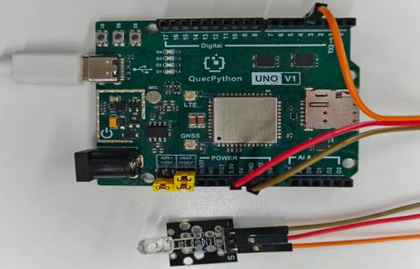

# LED模块

## **一、** **模块介绍**

LED原理及产业分类LED是发光二极体( Light EmitTIng Diode, LED)的简称，也被称作发光二极管，这种半导体组件发展以来一般是作为指示灯、显示板，但目前随着技术增加，已经能作为光源使用，它不但能够高效率地直接将电能转化为光能，而且拥有最长达数万小时～10 万小时的使用寿命，同时具备不若传统灯泡易碎，并能省电，同时拥有环保无汞、体积小、可应用在低温环境、光源具方向性、造成光害少与色域丰富等优点。

**LED组成：**


**发光原理：**


左为正极，右为负极。当正负极形成电压差时，LED点亮。

## 二、 连接示例

根据表格和图片指导，将外设与开发板一一对应连接

| 外设     | 开发板       |
| -------- | ------------ |
| LED（+） | 3.3V         |
| LED（-） | GND          |
| LED（S） | PIN4(GPIO31) |

 



## 三、 操作步骤

请参考目录中的开发指导手册


## 四、 驱动代码

```python
from machine import Pin

/# 创建gpio对象

gpio1 = Pin(Pin.GPIO31, Pin.OUT, Pin.PULL_DISABLE, 1)

/# 设置引脚电平

gpio1.write(1)
```

 