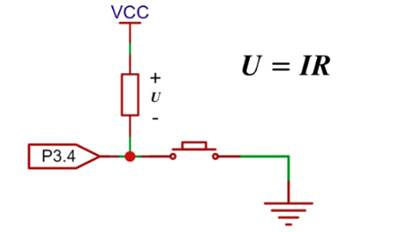
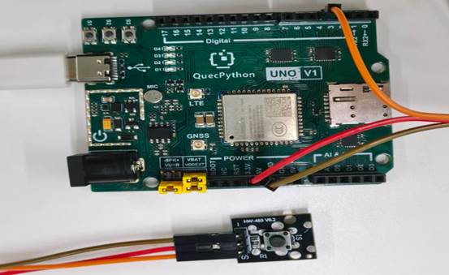
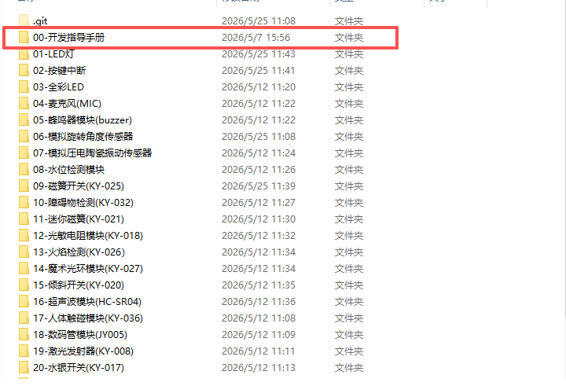

# 按键模块

## **一、** **模块介绍**

按键模块是**最基础的数字输入模块**，通过轻触开关实现通断控制，输出高低电平信号，用于实现**人机交互、开关控制、触发指令、计数、模式切换**等功能，是嵌入式 / 物联网项目必备模块。

**1、核心参数**

- 类型：轻触按键（机械式）
- 供电：3.3V–5V
- 输出：**数字信号（高 / 低电平）**
- 引脚：3 针（VCC、GND、SIG）
- 默认状态：**高电平（未按下）**
- 触发状态：**低电平（按下）**
- 自带：上拉电阻、信号指示灯

**2、原理图**



vcc和电阻都在芯片内部，当按键断开时，流过电阻的电流称为灌电流，大概几十毫安，因此此时引脚为高电平。按下时与地接通为低电平

 

 

## **二、** **连接示例**

根据表格和图片指导，将外设与开发板一一对应连接

| **外设**     | **模块**     |
| ------------ | ------------ |
| **KEY（+）** | 3.3V         |
| **KEY（-）** | GND          |
| **KEY（S）** | PIN4(GPIO31) |

 



## 三、 操作步骤

请参考目录中的开发指导手册



## **四、** **驱动代码**

```python
from machine import ExtInt

/# args[0]:gpio号 args[1]:上升沿或下降沿

def fun(args): 

      print(“按键按下”)

extint = ExtInt(ExtInt.GPIO31,ExtInt.IRQ_FALLING,ExtInt.PULL_PU,fun)

/#中断使能

extint.enable()
```

 