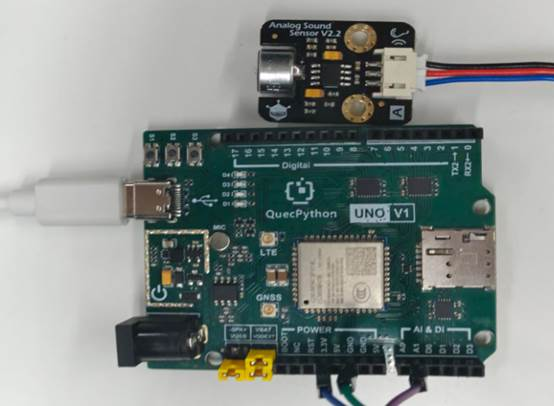

# 麦克风模块

## **一、** **模块介绍**

麦克风是**声电转换器件**的简称，也被称为声音检测传感器模块。它可以检测周围环境中的声音强度，并转换为电信号输出。它内部包含一个麦克风，可以捕捉声音信号。通过调节模块上的感敏度电位器，可以调节模块对声音的敏感度。它支持模拟输出模式，满足大部分应用及设计需求。

## 二、 连接示例

根据表格和图片指导，将外设与开发板一一对应连接

| 外设     | 开发板   |
| -------- | -------- |
| MIC（+） | 3.3V     |
| MIC（-） | GND      |
| MIC（S） | A1(ADC1) |

 

 

## 三、 操作步骤

请参考目录中的开发指导手册


## 四、 驱动代码

```python
def fun():

  while True:

     num=adc.read(adc.ADC1)

     utime.sleep(1)#出现具体电压值，通过电压值控制占空比

     print(num)


if name=='main':

  LED=Pin(1,Pin.OUT,Pin.PULL_DISABLE,0)

  adc = ADC()

  adc.open()

  _thread.start_new_thread(fun,())
```

 