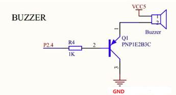
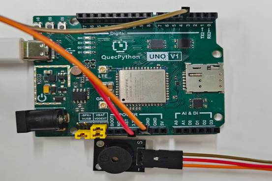

# 蜂鸣器模块

## **一、** **模块介绍**

用 Arduino 可以完成的互动作品有很多，最常见也最常用的就是声光展示了，前面一直都 是在用 LED 小灯在做实验，本个实验就让大家的电路发出声音，能够发出声音的最常见的 元器件就是蜂鸣器和喇叭了，两者相比较蜂鸣器更简单和易用所以我们本实验采用蜂鸣器。

**蜂鸣器及其原理** 

（一）蜂鸣器的介绍 

​	1．蜂鸣器的作用 蜂鸣器是一种一体化结构的电子讯响器，采用直流电压供电，广 泛应用于计算机、打印机、复印机、报警器、电子玩具、汽车电子设备、电		话机、定时器等 电子产品中作发声器件。

​	 2．蜂鸣器的分类 蜂鸣器主要分为压电式蜂鸣器和电磁式蜂鸣器两种类型。 

​	3．蜂鸣器的电路图形符号 蜂鸣器在电路中用字母“H”或“HA”（旧标准用 “FM”、“LB”、“JD”等）表示。 

（二）蜂鸣器的结构原理

 1．压电式蜂鸣器压电式蜂鸣器主要由多谐振荡器、压电蜂鸣片、阻抗匹配器及共鸣箱、外壳等组成。有的压电式蜂鸣器外壳上还装有发光二极管。 多谐振荡器由晶体管或集成电路构成。当接通电源后（1.5~15V 直流工作电压）,多 谐振荡器起振,输出 1.5~2.5kHZ 的音频信号，阻抗匹配器推动压电蜂鸣片发声。 压电蜂鸣片由锆钛酸铅或铌镁酸铅压电陶瓷材料制成。在陶瓷片的两面镀上银电极 经极化和老化处理后，再与黄铜片或不锈钢片粘在一起。

2．电磁式蜂鸣器 电磁式蜂鸣器由振荡器、电磁线圈、磁铁、振动膜片及外壳等组成。接通电源后，振荡器产生的音频信号电流通过电磁线圈，使电磁线圈产生磁场。振 动膜片在电磁线圈和磁铁的相互作用下，周期性地振动发声。 

**有源蜂鸣器与无源蜂鸣器有什么区别** 

这里的“源”不是指电源。而是指震荡源。 也就是说，有源蜂鸣器内部带震荡源，所以只要一通电就会叫。 而无源内部不带震荡源，所以如果用直流信号无法令其鸣叫。必须用 2K~5K 的方波去 驱动它。 有源蜂鸣器往往比无源的贵，就是因为里面多个震荡电路。 无源蜂鸣器的优点是：1．便宜，2．声音频率可控，可以做出“多来米发索拉西”的效 果。3．在一些特例中，可以和 LED 复用一个控制口 有源蜂鸣器的优点是：程序控制方便。

**发声原理：**



有源蜂鸣器模块低电平触发，通过配置I/O口，给它低电平即可发声。可见电路图如上

## 二、连接示例

根据表格和图片指导，将外设与开发板一一对应连接

| 外设        | 开发板       |
| ----------- | ------------ |
| BUZZER（+） | 3.3V         |
| BUZZER（-） | GND          |
| BUZZER（S） | PIN4(GPIO31) |

 



## 三、 操作步骤

请参考目录中的开发指导手册


## 四、 驱动代码

```python
from machine import Pin

/# 创建gpio对象

gpio1 = Pin(Pin.GPIO31, Pin.OUT, Pin.PULL_DISABLE, 1)

/# 设置引脚电平

gpio1.write(1)

 
```

 