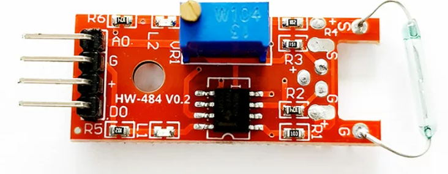

# KY-025 磁簧开关（干簧管）传感器模块介绍

KY-025是一款基于**磁簧开关（Reed Switch，又称干簧管）**原理的磁控传感器模块。它本质上是一个受磁场控制的微型电气开关，当有磁铁靠近时，内部的金属簧片会吸合导通电路；当磁铁远离时，簧片会自动弹开断开电路。

由于其结构简单、灵敏度高且无需直接接触即可触发，KY-025常被用于各种物联网项目中作为非接触式的接近检测或位置限位装置。

#### 核心特点

- **双重信号输出**：模块同时提供数字量（DO）和模拟量（AO）两种输出接口，既能做简单的开关判断，也能感知磁场强度的相对变化。
- **灵敏度可调**：板载精密电位器（微调旋钮），可以根据实际应用场景旋转调节传感器的探测距离和触发灵敏度。
- **直观的工作指示**：配有电源指示灯和工作状态LED，当检测到磁场触发时，板载LED会亮起，方便调试与观察。
- **宽电压兼容**：通常支持3.3V至5V的宽电压供电，能够完美适配Arduino、STM32以及你手中的QuecDuino等各类主流单片机开发板。

#### **引脚说明与接线**

KY-025模块通常引出4个标准引脚，具体的定义如下：

| 引脚名称    | 功能说明     | 接线建议                      |
| :---------- | :----------- | :---------------------------- |
| **+ (VCC)** | 电源正极     | 接开发板的 3.3V 或 5V         |
| **G (GND)** | 电源负极     | 接开发板的 GND                |
| **D0**      | 数字信号输出 | 接开发板的普通GPIO（如引脚4） |
| **A0**      | 模拟信号输出 | 接开发板的ADC引脚（如A0）     |

#### 工作原理详解

1. **数字输出（D0）**：这是一个开关量信号。当你调节好灵敏度后，一旦有磁铁进入有效探测范围，引脚4会输出高电平（或低电平，视具体电路设计而定），同时板载LED点亮；磁铁移开后恢复原状。这非常适合用来制作“门磁报警”或“到位检测”。
2. **模拟输出（A0）**：该引脚输出的电压值会随着磁场强度的变化而线性改变。通常情况下，没有磁场时输出较高数值，随着磁铁逐渐靠近，输出电压会逐渐降低。通过读取这个模拟值，你可以大致判断出磁铁与传感器之间的距离远近。

####  常见应用场景

- **门窗防盗报警**：将模块安装在门框，磁铁安装在门扇上，开门即触发警报。
- **智能计数与测速**：在风扇叶片或旋转物体上安装磁铁，每转一圈触发一次，从而计算转速或累计次数。
- **位置限位检测**：在机械臂或移动小车上，用于检测是否到达了预设的物理边界。
- **无触点开关**：作为珠宝盒、礼品盒的开盖亮灯触发器，既隐蔽又耐用。

### 操作步骤

请参考目录中的开发指导手册

