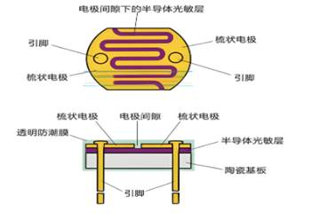
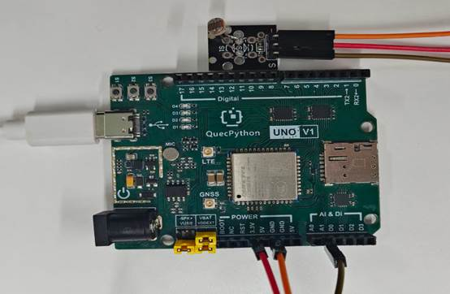

# 光敏电阻模块

## **一、** **模块介绍**

光敏电阻传感器是一种能够将光信号转换为电信号的传感器，其阻值会随着光照强度的变化而改变。在许多实际应用中，如自动照明系统、环境光检测等，光敏电阻传感器发挥着重要作用。 EG800Z Duino开发板具有丰富的外设资源，能够方便地与光敏电阻传感器结合使用，实现对光照强度的检测和处理。

光敏电阻通常由半导体材料制成，其工作原理基于内光电效应。当光线照射到光敏电阻上时，半导体材料中的电子会吸收光子的能量，从价带跃迁到导带，从而使材料的导电能力增强，电阻值降低。反之，当光照强度减弱时，电阻值会增大。

光敏电阻的特性曲线通常呈现出非线性 关系，即光照强度与电阻值之间不是简单的线性比例关系。在实际应用中，需要根据具体的需求和特性曲线来进行校准和处理。

**光敏电阻组成：**



**工作原理：**


**光照越强，电阻越小，电压越低；光照越弱，电阻越大，电压越高。**

## 连接示例

根据表格和图片指导，将外设与开发板一一对应连接

| 外设     | 开发板     |
| -------- | ---------- |
| LDR（+） | 3.3V       |
| LDR（-） | GND        |
| LDR（S） | A1（ADC1） |

 



## 二、 操作步骤

请参考目录中的开发指导手册


## 三、 驱动代码

```python
def fun():

  while True:

     num=adc.read(adc.ADC1)

     utime.sleep(1)#出现具体电压值，通过电压值控制占空比

     print(num)

     return num

def LED_SW(num):

  if num<50:

     LED.write(1)

     print("光线较强")

  else:

     LED.write(0)

     print("光线较弱")

if name=='main':

  LED=Pin(Pin.GPIO31,Pin.OUT,Pin.PULL_DISABLE,0)

  adc = ADC()

  adc.open()

  _thread.start_new_thread(fun,())

  while True:

     num=fun()     

     LED_SW(num)
```

