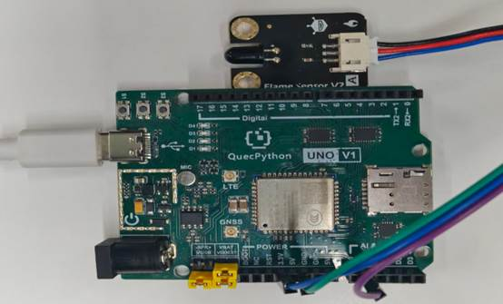

# 火焰检测模块

## **一、** **模块介绍**

火焰检测模块是用于**探测火焰 / 明火**的传感器模块，通过接收火焰产生的红外光，输出高低电平信号，实现火灾报警、火源检测。

**核心参数**

- 工作电压：3.3V–5V
- 输出：数字信号（无高 /有低）
- 输出：模拟信号（近高 / 远低）
- 检测角度：约 60°
- 接口：**MX1.25-2P**
- 用途：火焰检测、火灾报警、火源判断

 

## 二、连接示例

根据表格和图片指导，将外设与开发板一一对应连接

| 外设         | 开发板                   |
| ------------ | ------------------------ |
| Flame（+）   | 3.3V                     |
| Flame（-）   | GND                      |
| Flame（A/D） | A1（ADC1）/ PIN4(GPIO31) |

 



## 三、 操作步骤

请参考目录中的开发指导手册


## 四、 驱动代码

`模拟信号`

```python
def fun():

  while True:

     num=adc.read(adc.ADC0)

     utime.sleep(1)

     print(num)


if name=='main':

  adc = ADC()

  adc.open()

  _thread.start_new_thread(fun,())
```


`数字信号`

```python
gpio = Pin(Pin.GPIO31, Pin.IN, Pin.PULL_PU)

gpio1=Pin(Pin.GPIO30,Pin.OUT,Pin.PULL_DISABLE,0)

def main():

  /# 假设传感器检测到火焰时输出低电平（0）

  while True:

     if gpio.read() == 0:

       gpio1.write(1)

       print("检测到火焰")

     else:

       gpio1.write(0)

       print("没有检测到火焰")

     utime.sleep(1)

if name == "main":

  main()
```

``    

 