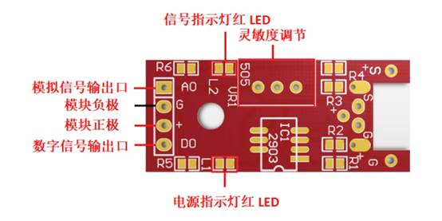
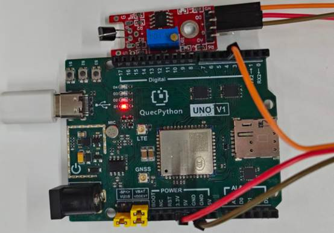

# 人体触摸模块

## **一、** **模块介绍**

该模块是一个基于触摸检测的电容式点动型触摸开关模块。·金属触摸模块是通过人体的电容来作出反应的。由于其是监测电容，还可以在模块表面覆盖非金属材料如木材、纸、塑料等等jue缘材料，来检测人的触摸可做成隐藏在墙壁、桌面等地方的按键。

**模块组成：**

 

**发光原理：**

模块有正极、负极、信号端。人体触摸感应片时，电容值发生变化，模块内部电路识别后输出高低电平信号，开发板可直接读取状态判断是否被触摸。

## 二、 连接示例

根据表格和图片指导，将外设与开发板一一对应连接

| 外设      | 开发板       |
| --------- | ------------ |
| 模块（+） | 3.3V         |
| 模块（-） | GND          |
| 模块（S） | PIN4(GPIO31) |

 



## 三、 操作步骤

请参考目录中的开发指导手册


## 四、 驱动代码

```` python
# 配置GPIO为输入，上拉

gpio = Pin(Pin.GPIO31, Pin.IN, Pin.PULL_PU)

def main():

# 假设传感器检测到触摸时输出高电平（1）

  while True:

        if gpio.read() == 1:

          print("检测到触摸")

        else:

          print("没有检测到触摸")

        utime.sleep(1)

if name == 'main':

  main()
````

