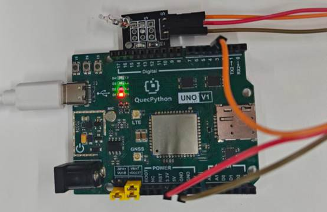

# 水银开关模块

## **一、** **模块介绍**

水银开关模块是**重力感应式倾斜 / 倾倒检测数字开关器件**，也叫倾侧开关、角度传感器，常用于倾斜报警、防倒保护、姿态检测、触发控制场景；依靠水银流动导通 / 断开电路，输出稳定高低电平，具有**灵敏度高、导通可靠、无机械触点噪音、3.3V/5V 兼容、GPIO 直读、体积小巧**等优点。

**发光原理：**

模块有正极、负极、信号端。利用水银的导电性与流动性，倾斜到一定角度时，水银流动接通电极，电路导通；复位后水银离开电极，电路断开，开发板通过读取电平判断倾斜状态。

## 二、 连接示例

根据表格和图片指导，将外设与开发板一一对应连接

| 外设          | 开发板       |
| ------------- | ------------ |
| 水银开关（+） | 3.3V         |
| 水银开关（-） | GND          |
| 水银开关（S） | PIN4(GPIO31) |

 



## 三、 操作步骤

请参考目录中的开发指导手册


## 四、 驱动代码

```python
/# 配置GPIO为输入，上拉

gpio = Pin(Pin.GPIO31, Pin.IN, Pin.PULL_PU)

gpio1=Pin(Pin.GPIO30,Pin.OUT,Pin.PULL_DISABLE,0)
 

def main():

  /# 假设传感器检测到倾斜时输出高电平（1）

  while True:

        if gpio.read() == 1:

        	print("水银检测到倾斜")

        else:

        	print("水银没有检测到倾斜")

        utime.sleep(1)
 

if name == 'main':

  main()
```

 